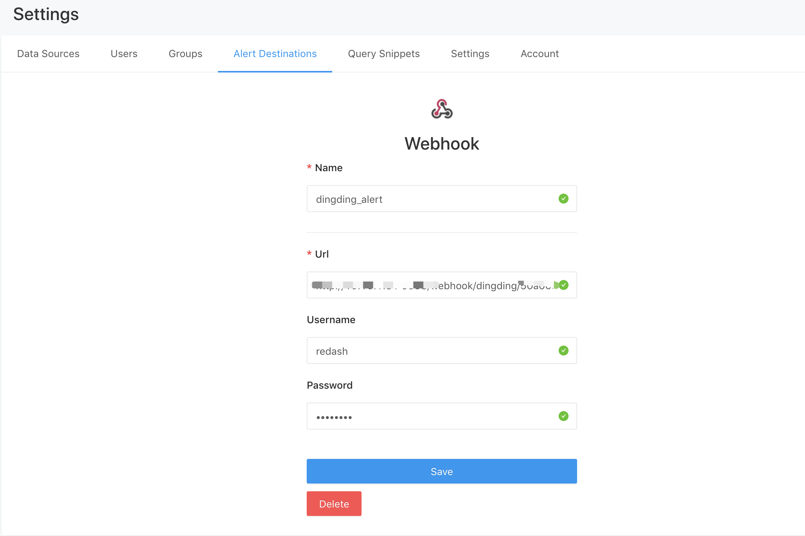
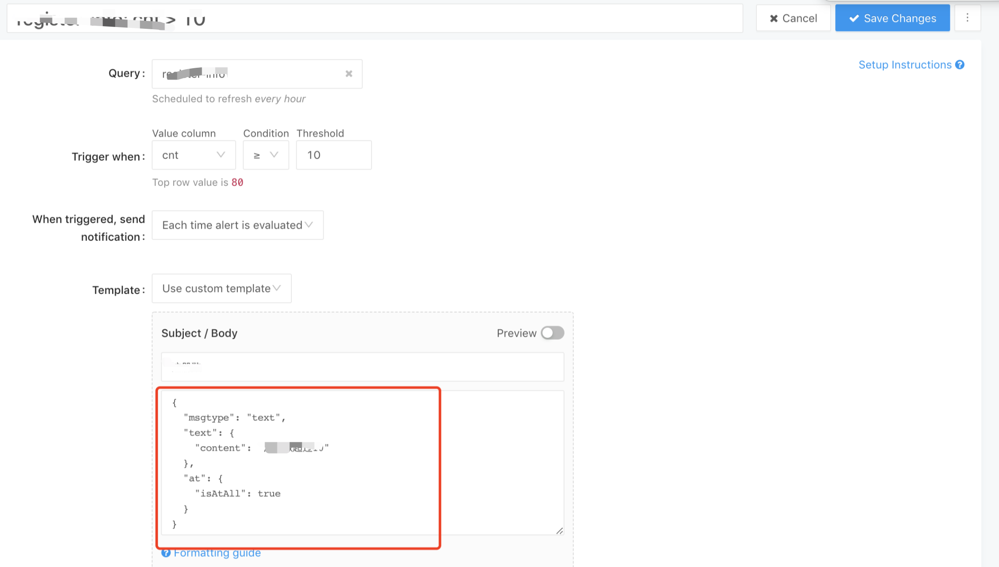

# redash-alert
> redash 支持钉钉，企业微信机器人通知

[](http://hits.dwyl.com/lishulongVI/redash-alert)

### zh

1. redash所支持的webhooks 并不支持钉钉，企业微信机器人通知方式
2. 通过redash支持的webhooks方式，曲线支持钉钉，企业微信
3. redash webhook 实现通知代码：[Redash Webhook](https://github.com/getredash/redash/blob/d0793c4ba8b28fcd0c40dd91453f8b5e19f9eb2d/redash/destinations/webhook.py#L28)
4. 这个项目通过符合redash webhook方式构建 webhook api，然后再进行路由转发给钉钉或者企业微信


### Quick start

1. cd /opt && git clone https://github.com/lishulongVI/redash-alert.git
2. cd redash-alert && pip3 install -r requirements.txt
3. python3 -m redash_alert.main 或者使用supervisor 启动，见supervisor-redash-alert.ini


### Reddish

##### 配置通知url



##### 配置alert




### 钉钉 & 企业微信
```
http://0.0.0.0:9998/webhook/dingding/{token}/
userName:redash
password:redash_2021

# 选择自定义模版 dingding body 的设置
{
     "msgtype": "text",
     "text": {
         "content": "我就是我, @150XXXXXXXX 是不一样的烟火"
     },
     "at": {
         "atMobiles": [
             "150XXXXXXXX"
         ], 
         "isAtAll": false
     }
 }

{
    "msgtype": "link", 
    "link": {
        "text": "这个即将发布的新版本，创始人xx称它为红树林。而在此之前，每当面临重大升级，产品经理们都会取一个应景的代号，这一次，为什么是红树林", 
        "title": "时代的火车向前开", 
        "picUrl": "", 
        "messageUrl": "https://www.dingtalk.com/s?__biz=MzA4NjMwMTA2Ng==&mid=2650316842&idx=1&sn=60da3ea2b29f1dcc43a7c8e4a7c97a16&scene=2&srcid=09189AnRJEdIiWVaKltFzNTw&from=timeline&isappinstalled=0&key=&ascene=2&uin=&devicetype=android-23&version=26031933&nettype=WIFI"
    }
}

{
     "msgtype": "markdown",
     "markdown": {
         "title":"杭州天气",
         "text": "#### 杭州天气 @150XXXXXXXX \n> 9度，西北风1级，空气良89，相对温度73%\n> \n> ###### 10点20分发布 [天气](https://www.dingtalk.com) \n"
     },
      "at": {
          "atMobiles": [
              "150XXXXXXXX"
          ],
          "isAtAll": false
      }
 }


{
    "msgtype": "actionCard",
    "actionCard": {
        "title": "我 20 年前想打造一间苹果咖啡厅，而它正是 Apple Store 的前身", 
        "text": " \n\n #### 乔布斯 20 年前想打造的苹果咖啡厅 \n\n Apple Store 的设计正从原来满满的科技感走向生活化，而其生活化的走向其实可以追溯到 20 年前苹果一个建立咖啡馆的计划", 
        "hideAvatar": "0", 
        "btnOrientation": "0", 
        "btns": [
            {
                "title": "内容不错", 
                "actionURL": "https://www.dingtalk.com/"
            }, 
            {
                "title": "不感兴趣", 
                "actionURL": "https://www.dingtalk.com/"
            }
        ]
    }
}
```

### 飞书格式

```
{
    "msg_type": "text",
    "content": {
        "text": "request example"
    }
}


{
    "msg_type": "post",
    "content": {
        "post": {
            "zh_cn": {
                "title": "项目更新通知",
                "content": [
                    [
                        {
                            "tag": "text",
                            "text": "项目有更新: "
                        },
                        {
                            "tag": "a",
                            "text": "请查看",
                            "href": "http://www.example.com/"
                        }
                    ]
                ]
            }
        }
    }
}


```